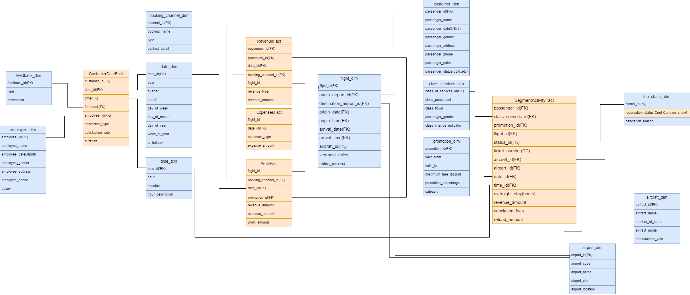
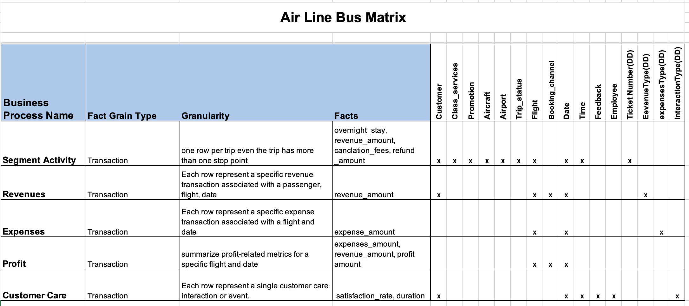

# Airline Data Warehouse Case Study

## 📌 Project Overview
This project is a Data Warehouse implementation for an airline company, designed to track and analyze critical business processes such as trip activities, revenue, expenses, profits, and customer interactions. The database follows a **star schema** model, ensuring efficient analytical queries and performance.

## 📁 Table of Contents
- [Project Overview](#-project-overview)
- [Data Model](#-data-model)
  - [Fact Tables](#-fact-tables)
  - [Dimension Tables](#-dimension-tables)
- [Queries for Decision Making](#-queries-for-decision-making)
- [Indexing Strategy](#-indexing-strategy)
- [Why This Design?](#-why-this-design)
- [How to Use](#-how-to-use)
- [License](#-license)

## 🏗 Data Model
The data warehouse is structured using a **star schema**, consisting of multiple fact tables linked to relevant dimension tables.

### 📊 Fact Tables
| Fact Table              | Business Process                                      | Measures                                          |
|------------------------|-------------------------------------------------|-------------------------------------------------|
| `SegmentActivityFact`  | Tracks trip-related activities                   | overnight_stay, revenue_amount, refund_amount, cancellation_fees |
| `RevenueFact`         | Records revenue transactions                    | revenue_amount                                  |
| `ExpensesFact`        | Logs flight expenses                            | expense_amount                                  |
| `ProfitFact`          | Summarizes financial performance                 | revenue_amount, expense_amount, profit_amount  |
| `CustomerCareFact`    | Tracks customer interactions                     | satisfaction_rate, duration                    |

### 📌 Dimension Tables
| Dimension Table         | Purpose                                          |
|------------------------|-------------------------------------------------|
| `customer_dim`         | Stores passenger information                   |
| `flight_dim`           | Stores flight details                          |
| `date_dim`             | Stores date-related attributes                 |
| `time_dim`             | Stores time-related attributes                 |
| `airport_dim`          | Stores airport details                         |
| `booking_channel_dim`  | Tracks booking sources                         |
| `class_services_dim`   | Tracks service class purchases                 |
| `promotion_dim`        | Stores promotions and discounts                |
| `employee_dim`         | Stores customer service employee details       |

### Bus Matrix


## 📈 Queries for Decision Making
Several SQL queries are designed to support business decisions, including:
- Identifying frequent flyer trends
- Analyzing the impact of promotions on revenue
- Evaluating profitability of flights
- Measuring customer satisfaction from interactions

Example Query: Retrieve the **top 5 most profitable flights**
```sql
SELECT flight_id, SUM(profit_amount) AS total_profit
FROM ProfitFact
GROUP BY flight_id
ORDER BY total_profit DESC
FETCH FIRST 5 ROWS ONLY;
```

## 🚀 Indexing Strategy
To optimize query performance, indexes are implemented:
- **B-Tree Indexes**: Used for primary and foreign keys.
- **Bitmap Indexes**: Applied on low-cardinality fields (e.g., passenger status).
- **Composite Indexes**: Improve multi-column searches.
- **Function-Based Indexes**: Enhance filtering based on date/time.

## 🎯 Why This Design?
- **Efficient Query Performance:** Optimized for analytical queries.
- **Scalability:** Handles large datasets effectively.
- **Business Alignment:** Fact tables align with airline business processes.
- **Historical Data Support:** Tracks changes over time with Slowly Changing Dimensions (SCDs).

## 🛠 How to Use
1. Clone the repository:
   ```sh
   git clone https://github.com/yourusername/airline-data-warehouse.git
   ```
2. Import the SQL schema into your database.
3. Run analytical queries for insights.

## 📜 License
This project is open-source under the [MIT License](LICENSE). Feel free to contribute and enhance the dataset!

---
✈ **Developed for Data Warehouse Analytics in the Airline Industry**

